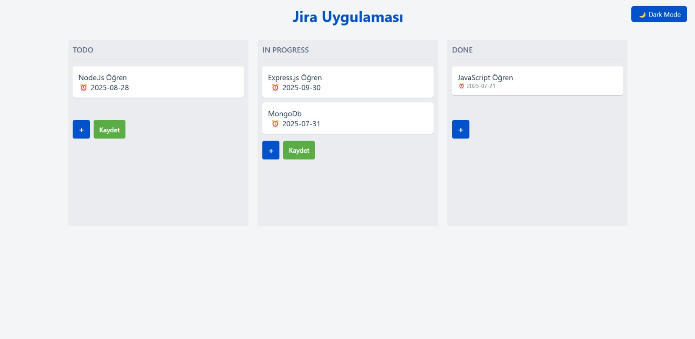
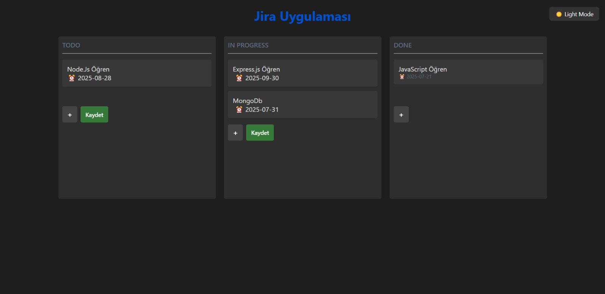

## 🧩 Jira Klonu - Kanban Görev Yönetimi

Bu proje, temel Jira mantığında çalışan bir Kanban görev yönetimi uygulamasıdır. Kullanıcılar görev ekleyebilir, tarih atayabilir, görevleri sütunlar arasında sürükleyebilir ve tema geçişi yapabilir.

---

## 🚀 Özellikler

# ✅ Görev Ekleme
- Her sütunun altında “+” butonu ile görev eklenebilir.
- Görevler `contenteditable` div'e yazılır.
- Göreve istenirse tarih atanabilir.
- “Kaydet” butonuyla görev listeye eklenir.

# 📆 Tarih Etiketleri
- Görevler eklenirken tarih seçilirse, görev kartının altında `⏰ YYYY-MM-DD` etiketi görünür.

# ✏️ Görev Güncelleme
- Eklenen görevler üzerine tıklanarak düzenlenebilir.
- Düzenleme sonrası odaktan çıkıldığında otomatik kaydedilir.

# 🧲 Sürükle-Bırak Desteği
- Görevler `Todo`, `In Progress`, ve `Done` sütunları arasında drag & drop ile taşınabilir.
- Her görev `draggable="true"` özelliğine sahiptir.

# 💾 Kalıcı Kayıt (LocalStorage)
- Uygulama localStorage kullanarak görevleri tarayıcıda saklar.
- Sayfa yenilendiğinde veriler silinmez.

# 🌙 / ☀️ Tema Geçişi
- Sağ üstteki düğme ile `Karanlık Tema` ve `Aydınlık Tema` arasında geçiş yapılabilir.
- Seçilen tema bilgisi localStorage’a kaydedilir.

# 📱 Responsive Tasarım
- Mobilde sütunlar alt alta gelir.
- Masaüstü ve mobil uyumlu yapı.

# 🎞️ Animasyonlar
- Görev ekleme ve taşıma sırasında `fade` ve `bounce` animasyonları uygulanır.

---

## 🖼️ Ekran Görüntüsü

