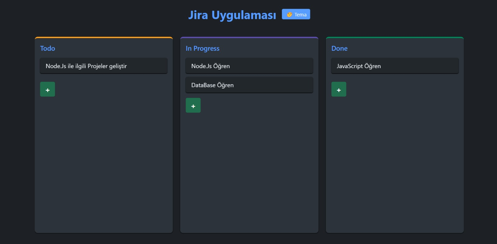
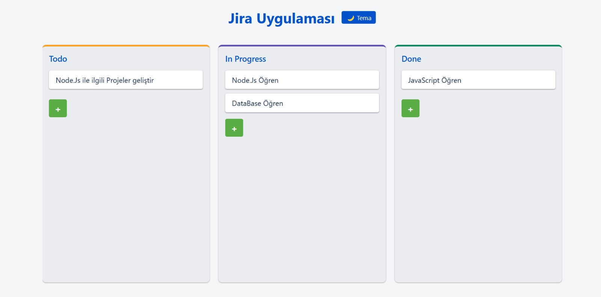

# Jira Uygulaması

Bu proje, kullanıcıların görevlerini kolayca takip edebileceği bir **Jira** benzeri görev yönetim uygulamasıdır. Kullanıcılar, görevlerini farklı aşamalarda (Todo, In Progress, Done) sürükleyip bırakabilirler. Tema değişikliği, görevlerin kaydedilmesi ve bir dizi diğer özelleştirilmiş özellikleri içerir.

## Özellikler

- **Sürükle ve Bırak**: Görevler, "Todo", "In Progress" ve "Done" sütunları arasında sürüklenebilir.
- **Görev Ekleme**: Her sütun için yeni görevler eklenebilir.
- **Tema Değiştirme**: Uygulama, koyu ve açık tema arasında geçiş yapma desteği sunar.
- **Yerel Depolama Desteği**: Kullanıcıların görevleri, yerel depolama (localStorage) sayesinde tarayıcıda kaydedilir ve sayfa yenilendiğinde bile korunur.
- **Responsive Tasarım**: Uygulama, tüm cihazlarda sorunsuz çalışacak şekilde tasarlanmıştır.

## Kullanılan Teknolojiler

- **HTML**: Yapı
- **CSS**: Stilleme (Flexbox, Animasyonlar, Responsive Tasarım)
- **JavaScript**: Fonksiyonellik (Sürükle ve Bırak, Tema Değiştirme, Yerel Depolama)
- **Yerel Depolama (localStorage)**: Görevlerin kaydedilmesi ve sayfa yenilendikçe korunması

## 📸 Ekran Görüntüsü

